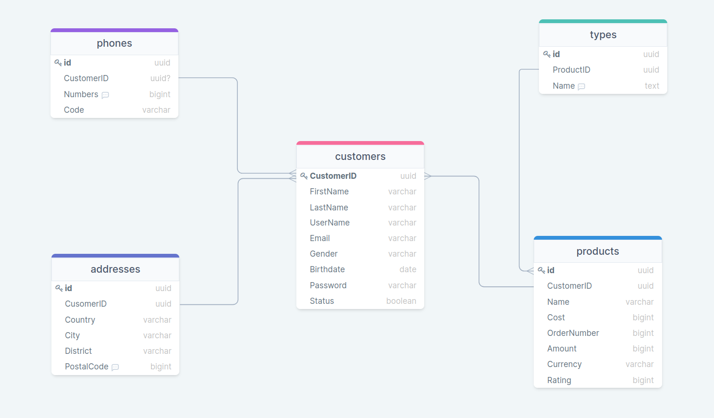

## Project1

1 I created 4 struct Customer, Phones, Addresses, Types, Products.

2 I created new database project1, and I created tables.

3 I wrote 2 methods for Customer: Insert, Get.

4 Insert does insert object to the tables from db.

5 Get does get object via uuid Customer from tables and print it like json format.