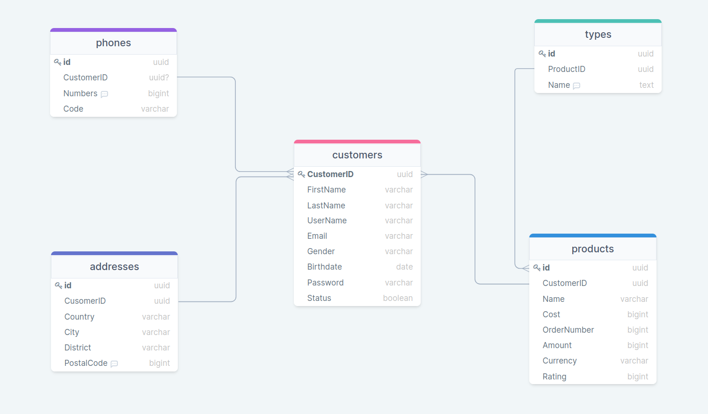
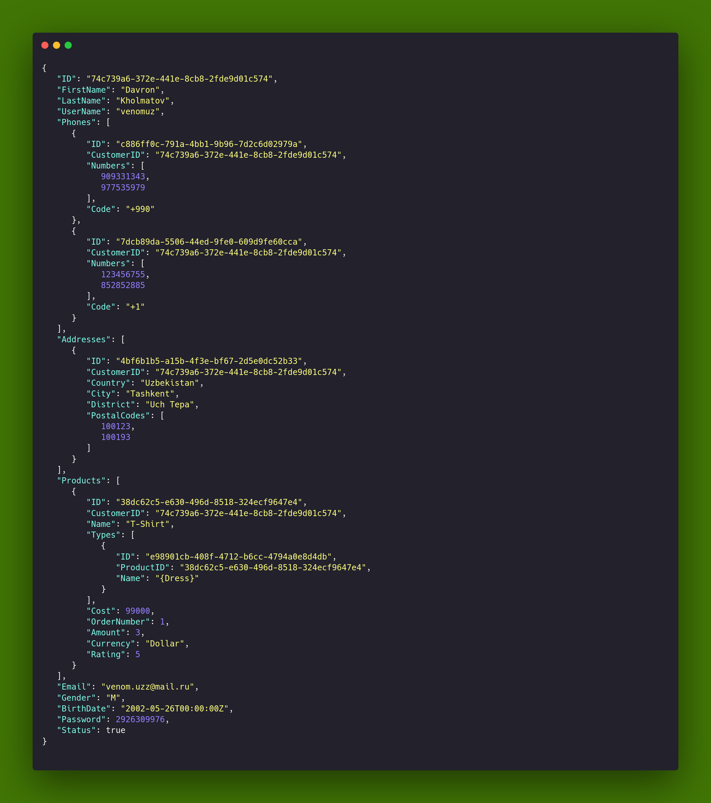

## Project1

1 I created 4 struct Customer, Phones, Addresses, Types, Products.

2 I created new database project1, and I created tables.

3 I wrote 2 methods for Customer: Insert, Get.

insert() - inserts objects to the tables from database

get() - gets object via uuid Customer from tables and prints it in a JSON format

## RESULT

